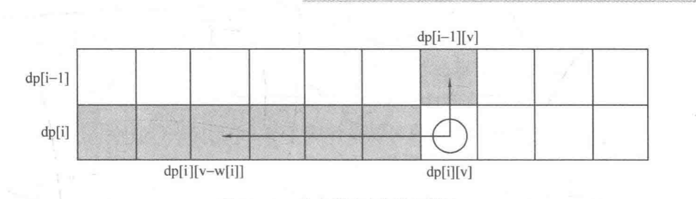

# 背包问题

## 多阶段动态规划问题

有一类动态规划可解的问题，它可以描述称为若干有序的阶段，且每个阶段的状态只和上一个阶段的状态有关，一般把这类问题称为多阶段规划问题。

## 01 背包问题

01背包问题描述如下：

> 有 n 件物品，每件物品的重量为 w[i]，价值为 c[i]。现有一个容量为 V 的背包，问如何选取物品放入背包，使得背包内物品的总价值最大。其中每种物品都只有一件。
>
> 例子：
> 5 8	// 5 件物品， 容量为 8
>
> 3 5 1 2 2	 // w[i] 重量
>
> 4 5 2 1 3	 // c[i] 价值

如果采取暴力搜索的方法，每件物品都有两种选择，因此 n 件物品就有 2<sup>n</sup>，而O（ 2<sup>n</sup>） 的时间复杂度完全是不能接受的。而使用动态规划可以将复杂度将为 O（nV）。

令` dp[i][v] `表示前 i 件物品恰好装入容量为 v 的背包中所能获得的最大价值。那怎么求解 `dp[i][v]` 呢？

考虑第 i 件物品的选择策略，有两种策略：

* 不放第 i 件物品，那么转化为前 i - 1 件物品恰好装入容量为 v 背包中所能获得的最大价值， `dp[i-1][v]` 。
* 放第 i 件物品，那么问题转换为前 i - 1 件物品恰好装入容量为 v - w[i] 的背包中所能获得的最大价值，也就是 `dp[i-1][v-w[i]] + c[i]`

由于只有这两种策略，所以状态转移方程为

<p style="text-align:center"> <strong> dp[i][v] = max{ dp[i-1][v], dp[i-1][v-w[i]] + c[i] } </strong> </p>

由于 `dp[i][v]` 只与之前的状态 `dp[i-1][]` 有关，所以可以枚举 i 从 1 到 n，v 从 0 到 V，通过边界 `dp[0][v] = 0`（即前 0 件物品放入任何容量 v 的背包中都只能获得价值 0）就可以把整个 dp 数组递推出来。而 `dp[i][v]` 表示的恰好为 v 的情况，所以需要枚举 `dp[n][v]` 取其最大值。

因此可以写出代码：

```cpp
for(int i = 1; i <= n; i++) {
  // 装第 i 件物品
  for(int v = w[i]; v <= V; v++) {
    dp[i][v] = max(dp[i-1][v], dp[i-1][v-w[i]] + c[i]);
  }
}
```

时间复杂度和空间复杂度都是  O（nV），时间复杂度不能再优化，但空间复杂度还可以优化。

注意到状态转移方程中计算` dp[i][v]` 总是需要 `dp[i-1][v]` 左侧部分的数据（即正上方和左上方的数据），且当计算 `dp[i+1][]` 时，`dp[i-1]` 的数据又用不到了（只需要用 `dp[i][]`），所以我们可以直接开一个一维数组`dp[v]`！枚举方向从 1 到 n，v 从 V 到 0 （逆序），这样，状态转移方程为：

 <p style="text-align:center"> <strong> dp[v] = max{ dp[v], dp[v-w[i]] + c[i] } </strong> </p>


可以这样理解，`dp[i][v]` 左上角的数据和 `dp[i][v]` 右边的数据放在同一个数组里面，每次计算出一个 `dp[i][v]` ，将相当于把 `dp[i-1][v]` 覆盖掉，因为之后的计算不需要再用到了。我们把这种技巧称为 **滚动数组**。

代码如下：

```cpp
for(int i = 1; i <= n; i++) {
  for(int v = V; v >= w[i]; v--) {
    dp[v] = max(dp[v], dp[v-w[i]] + c[i]);
  }
}
```

这样就可以用一维数组解决了，空间复杂度为 O(V)。

特别说明： **如果用二维数组存放，v 的枚举顺序是顺序还是逆序无所谓，如果用到一维数组，v 的枚举就必须是逆序！**

完整求解 01 背包代码如下：

```cpp
#include <iostream>
#include <cstdio>
#include <cstdint>
using namespace std;

const int maxn = 1010;

int C, N;   // 最大报销钱数，菜品数量
int V[maxn], P[maxn];   // 菜的评价分数，菜的价格
int dp[maxn];   // dp数组

int max(int a, int b) {
    return a > b ? a : b;
}

int main()
{
    freopen("data.txt","r", stdin);
    while (scanf("%d%d", &C, &N) != EOF)
    {
        for (int i = 0; i < N; i++)
        {   // 菜的价格，菜的评价
            scanf("%d%d", &P[i], &V[i]);    
        }
        fill(dp, dp + maxn, 0); // 初始化为 0
        for (int i = 0; i < N; i++)
        {   // 枚举菜品
            for (int v = C; v >= P[i]; v--)
            {
                dp[v] = max(dp[v], dp[v-P[i]] + V[i]);
            } 
        }
        printf("%d\n", dp[C]);
    }
    return 0;
}

/*
    Author: Veeupup
    点菜问题，01 背包

    input:
        90 4
        20 25
        30 20
        40 50
        10 18
        40 2
        25 30
        10 8

    output:
        95
        38
 */
```

01 背包中的每个物品都可以看作一个阶段，这个阶段的状态有 `dp[i][0] ~ dp[i][V]`，它们均由上一个阶段的状态得到。事实上，**对于能够划分阶段的问题来说，都可以尝试把阶段作为状态的一维**，这可以方便的得到满足无后效性的的状态。如果当前的设计不满足无后效性，那么不妨把状态进行升维，即增加一维或若干维来表示相应的信息，这样可能就满足无后效性了。

## 完全背包问题

完全背包问题描述如下：

> 有 n 中物品，每种物品的单件重量为 w[i]，价值为 c[i]。现在有一个容量为 V 的背包，问如何选取物品放入背包，使得背包内物品的总价值最大。每件物品都有无穷件。

和 01 背包唯一不同的地方就在于物品有了无数件，同样使用动态规划：
设置一个二维数组，` dp[i][v] `表示前 i 件物品恰好装入容量为 v 的背包中所能获得的最大价值。数组 `dp[n][m]` 的值就是完全背包问题的解。

和 0-1 背包一样，只考虑第 i 件物品时，可将情况分为是否放入第 i 件物品两种情况：

* 不放第 i 件物品，`dp[i][v] = dp[i-1][v]`
* 放第 i 件物品，由于放了第 i 件物品之后还是可以接着放，所以转移到 `dp[i][j-w[i]]，`，即 `dp[i][j] = dp[i][j-w[i]] + v[i]`

所以状态转移方程为 ：

<p style="text-align:center"> <strong> dp[i][j] = max{ dp[i-1][j], dp[i][v-w[i]] + c[i] } </strong> </p>

边界： `dp[0][v] = 0`

其实唯一的区别就在于 max 的第二个参数换成了 dp[i] 而不是 dp[i-1]，所以同样可以写成一维形式：

 <p style="text-align:center"> <strong> dp[v] = max{ dp[v], dp[v-w[i]] + c[i] } </strong> </p>

写成一维形式之后和 01 背包完全相同，唯一的区别在于此处是 **正向枚举**，而 01 背包中的一维形式必须是 **逆向枚举**，完全背包的一维形式代码如下：

```cpp
for(int i = 1; i <= n; i++) {
  for(int v = w[i]; v <= V; v++) {
    dp[v] = max(dp[v], dp[v-w[i]] + c[i]);
  }
}
```

正向枚举是因为求解 `dp[i][v]` 总是需要它左边的 `dp[i][v-w[i]]` 和它上方的 `dp[i-1][v]`，显然如果 v 从小到大枚举，`dp[i][v-w[i]]` 就总是计算出的结果，而计算出 `dp[i][v]` 之后就再也用不到 `dp[i-1][v]` 了，所以必须正向枚举。



完全背包代码如下：

```cpp
/*
    Author: Veeupup
    点菜问题，01 背包

    input:
        90 4
        20 25
        30 20
        40 50
        10 18
        40 2
        25 30
        10 8

    output:
        95
        38

 */
#include <iostream>
#include <cstdio>
#include <cstdint>
using namespace std;

const int maxn = 1010;

int C, N;   // 最大报销钱数，菜品数量
int V[maxn], P[maxn];   // 菜的评价分数，菜的价格
int dp[maxn];   // dp数组

int max(int a, int b) {
    return a > b ? a : b;
}

int main()
{
    freopen("data.txt","r", stdin);
    while (scanf("%d%d", &C, &N) != EOF)
    {
        for (int i = 0; i < N; i++)
        {   // 菜的价格，菜的评价
            scanf("%d%d", &P[i], &V[i]);    
        }
        fill(dp, dp + maxn, 0); // 初始化为 0
        for (int i = 0; i < N; i++)
        {   // 枚举菜品
            for (int v = p[i]; v <= C; v++)
            {
                dp[v] = max(dp[v], dp[v-P[i]] + V[i]);
            } 
        }
        printf("%d\n", dp[C]);
    }
    return 0;
}
```

搞懂 01 这些经典的动态规划问题，就能够理解动态规划的意义所在了。