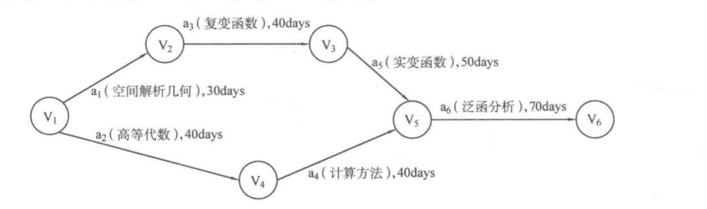
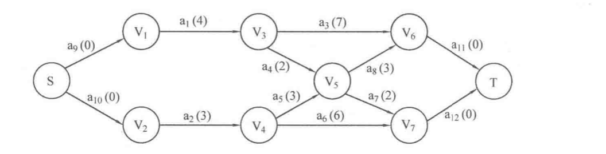

# 关键路径

[TOC]

## AOV网和AOE网

顶点活动（Activity On Vertex，AOV）网是指用顶点代表活动，而用边集代表活动间优先关系的有向图。

边活动（Activity On Edge，AOE）网是指用带权的边集代表活动，而用顶点表示事件的有向图，其中边权代表完成活动所需要的时间。例如在下图中：

a1 到 a6 代表需要学习的课程，也就是活动，而边权代表学习需要消耗的时间；顶点 V1 到 V6 表示此时刻为止前面的课程已经学完，后面的课程可以开始学习。这里的 “事件” 显然代表一种状态。

一般来说，采用 AOE 网表示一个工程的进行，工程常常可以分为若干子工程，AOE 网不应当有环（都是有向无环图），考虑到工程来说总会有一个起始时刻和一个结束时刻，因此 AOV 网一般只有一个源点（入度为0）和一个汇点（出度为0）。即使有多个源点和汇点，也可以通过添加 “超级源点” 和 “超级汇点” 来转换成一个源点和一个汇点的情况。

需要指出，如果给定 AOV 网中各个顶点活动所需要的时间。可以将其转换为 AOE 网。

比较简单的方式：将 AOV 网中每个顶点拆成两个顶点，分别代表活动的起点和终点，而两个顶点之间用有向边连接，有向边表示原顶点的活动，边权给定；院 AOV 网中的边权全部视为空活动，边权为 0.

AOE 网中的**最长路径** 被称为 **关键路径**，而把关键路径上的活动称为 **关键活动**，显然关键活动会影响整个工程的进度，起始也就是完成工程的最短时间。

## 最长路径

如果需要求最长路径长度，可以把所有边权乘以 -1 ，令其变为相反数，然后使用 Bellman-Ford 算法或者 SPFA 算法求最短路径长度。

如果图中有正环，那么最长路径不存在。最长路径问题是 NP-hard 问题（没有多项式时间复杂度算法的问题）。

最长路径问题，即 Longest Path Problem，寻求的是图中的最长简单路径。

