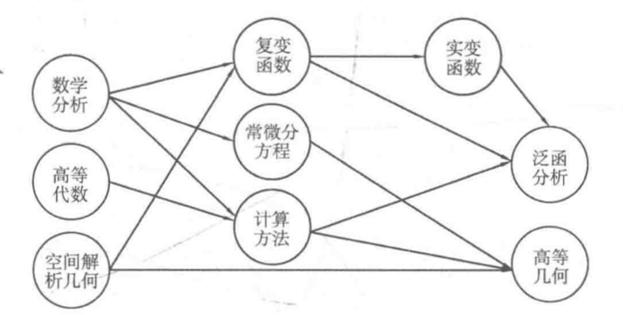
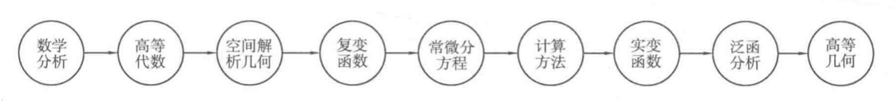

# 拓扑排序

[TOC]

## 有向无环图

如果一个有向图的任意顶点都无法通过一些有向边回到自身，那么称这个图为有向无环图（Directed Acyclic Graph, DAG）。

## 拓扑排序

拓扑排序是将有向无环图 G 的所有顶点排序成一个线性序列，使得对图 G 中的任意两个顶点 u，v，如果存在边 u->v ，那么序列 u 一定在 v 前面。这个序列称为 **拓扑序列**。

我们以数学专业的专业课的学习先后顺序为例，要学习一门课，至少要学习它的先导课程，比如，我们想要学习复变函数，就必须先学习数学分析和空间解析几何，而且先导课程之间不能形成环。



同时会发现，如果两门课程之间没有直接或间接的先导关系，那么这两门学习的先后顺序是任意的。比如说数学分析、高等代数和空间解析几何：



### 排序方法

基本思路：

1. 定义一个队列 Q，并且把所有入度为 0 的结点加入队列
2. 取队首结点，然后删去所有从它出发的边，并且令这些边到达的顶点的入度减1，如果某个顶点的入度减为 0，则将其加入队列
3. 反复进行 2 操作，直到队列为空。如果队列为空时入过队的数目恰好为N，说明拓扑排序成功，图G为有向无环图；否则，拓扑排序失败，图G中有环。

可以使用邻接表来实现拓扑排序。因为需要记录结点的入度，所以额外建立一个数组 `inDegree[maxn]` ，并在程序一开始读入图时就记录好每个结点的入度。

```cpp
vector<int> G[maxn];
int n, m, inDegree[maxn];	// 顶点数，入度

// 拓扑排序
bool topologicalSort() {
  int num = 0;
  queue<int> q;
  for(int i = 0; i < n; i++) {
    if(inDegree[i] == 0) {
      q.push(i);	// 所有入度为 0 的顶点入队
    }
  }
  while(!q.empty()) {
    int u = q.front();	// 取队首顶点 u
    // printf("%d, u");	// 此处可以输出顶点u，作为拓扑排序中的顶点
    q.pop();
    for(int i = 0; i < G[u].size(); i++) {
      int v = G[u][i];	// u 的后继结点 v
      inDegree[v]--;		// v 入度 -1
      if(inDegree[v] == 0) {
        // 顶点 v 的入度减为 0 则入队
        q.push(v);
      }	
    }
    G[u].clear();	// 清空顶点 u 的所有出边（如无必要可以不写）
    num++;
  }
  if(num == n) return true;
  else return false;
}

```

拓扑排序很重要的一个应用就是判断一个给定的图是否是有向无环图，如果上述的拓扑排序函数返回 true，则是 DAG，否则不是 DAG。

如果有多个入度为 0 的点，选择编号最小的顶点，把 queue 换成 priority_queue 即可，并保持队首元素是队列中的最小元素。

